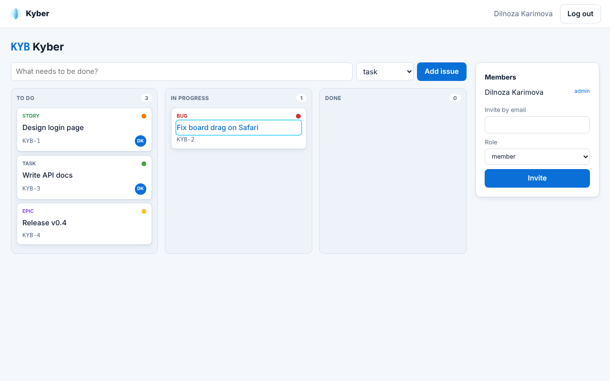
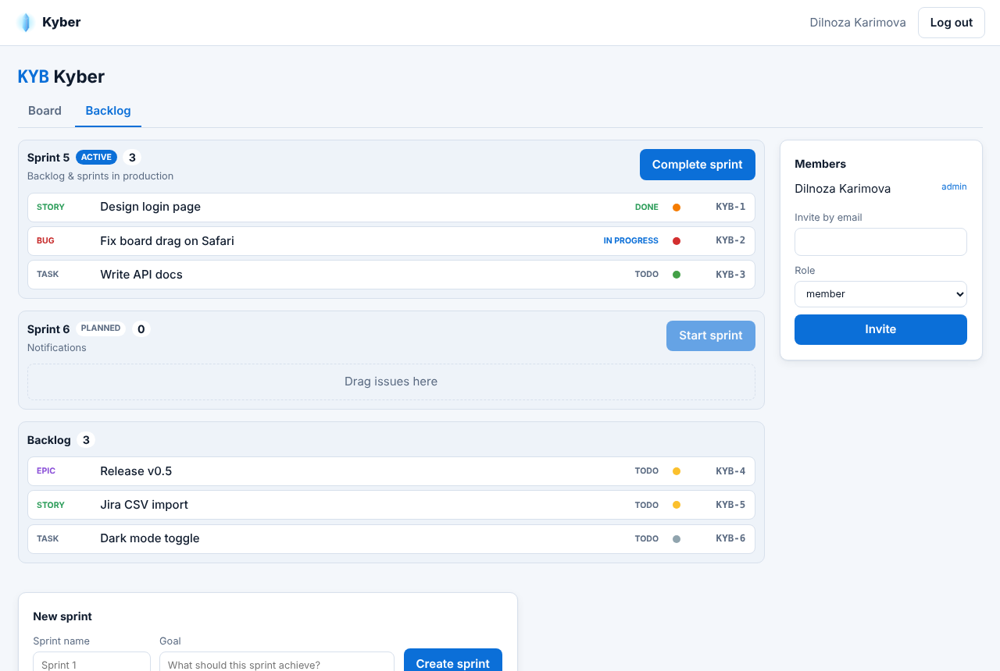
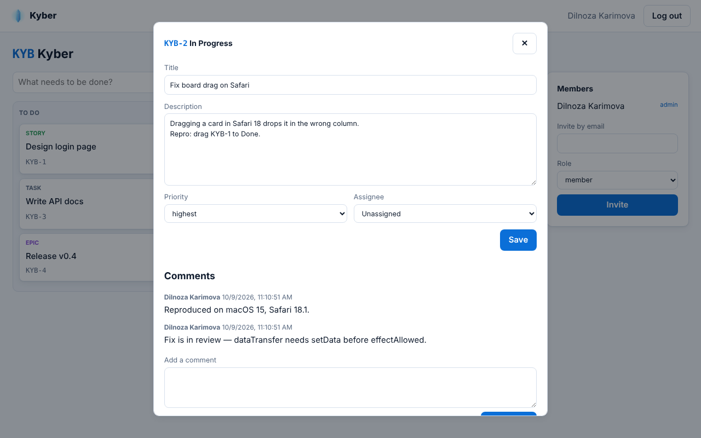
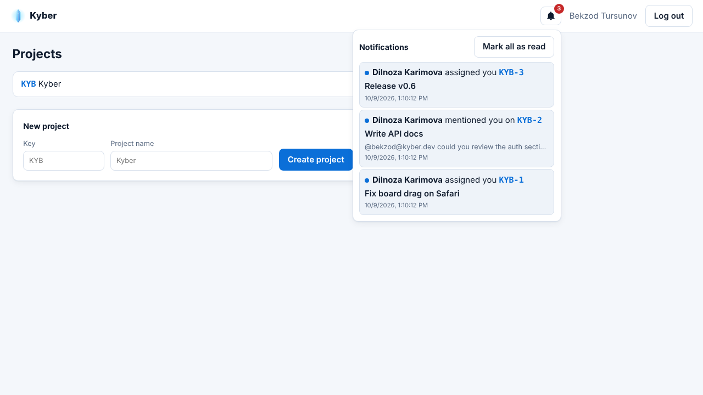

<p align="center"></p>
<h1 align="center">Kyber</h1>
<p align="center">Open-source, self-hosted issue &amp; project tracker — the core of Jira, in one Go binary.</p>

> Status: **v0.6 (Sprint 06)** — notifications & @mentions, Scrum backlog & sprints, issue details & comments, Kanban board, project roles, OpenAPI contract, localized errors (en/uz/ru), PostgreSQL, optional Redis.

<p align="center"></p>
<p align="center"></p>
<p align="center"></p>
<p align="center"></p>
> Roadmap: [`docs/PLAN.md`](docs/PLAN.md) · Backlog: [`docs/backlog`](docs/backlog) · QA: [`docs/qa`](docs/qa)

## Quick start

```bash
docker compose up --build    # PostgreSQL + Kyber (UI + API) on http://localhost:8080

curl -XPOST localhost:8080/api/v1/auth/signup -d '{"email":"me@example.com","name":"Me","password":"a long password"}'
TOKEN=$(curl -s -XPOST localhost:8080/api/v1/auth/login -d '{"email":"me@example.com","password":"a long password"}' | jq -r .token)
H="Authorization: Bearer $TOKEN"
curl -H "$H" -XPOST localhost:8080/api/v1/projects -d '{"key":"KYB","name":"Kyber"}'
curl -H "$H" -XPOST localhost:8080/api/v1/projects/KYB/issues -d '{"title":"Login page","type":"task"}'
curl -H "$H" -XPOST localhost:8080/api/v1/issues/KYB-1/transitions -d '{"to":"in_progress"}'
```

| Env | Default | Purpose |
|---|---|---|
| `KYBER_ADDR` | `:8080` | Listen address |
| `KYBER_DATABASE_URL` | — | PostgreSQL URL; unset = in-memory dev mode |
| `KYBER_REDIS_URL` | — | Optional; shares the login limiter across replicas (guard) |
| `KYBER_COOKIE_SECURE` | `true` | Set `false` only for plain-HTTP local use |
| `KYBER_SESSION_PURGE_EVERY` | `1h` | Expired-session cleanup interval (jittered) |

## API (v1)

Full contract: [`api/openapi.yaml`](api/openapi.yaml) (OpenAPI 3.1, enforced by the test suite).
Errors are [RFC 9457](https://www.rfc-editor.org/rfc/rfc9457) `application/problem+json` with a stable `code`; titles follow `Accept-Language` (en, uz, ru).

| Method | Path | Description |
|---|---|---|
| GET | `/healthz` · `/readyz` · `/metrics` | Liveness · readiness (DB) · Prometheus |
| POST | `/api/v1/auth/signup` · `/auth/login` · `/auth/logout` | Accounts & sessions (cookie or Bearer) |
| GET | `/api/v1/me` | Current user |
| GET / POST | `/api/v1/projects/{key}/members` | List members / add or change a member's role (admin) |
| POST / GET | `/api/v1/projects` | Create / list projects |
| GET | `/api/v1/projects/{key}` | Get project |
| POST / GET | `/api/v1/projects/{key}/issues[?status=]` | Create / list issues |
| GET · PATCH | `/api/v1/issues/{KEY-N}` | Get issue · edit title/description/priority/assignee (with `version`) |
| GET · POST | `/api/v1/issues/{KEY-N}/comments` | List · add comments |
| POST | `/api/v1/issues/{KEY-N}/rank` | Move in the backlog (`after` / `before` another issue) |
| GET · POST | `/api/v1/projects/{key}/sprints` | List · create sprints |
| POST | `/api/v1/sprints/{id}/start` · `/complete` | Start · complete (unfinished issues return to the backlog) |
| GET | `/api/v1/notifications[?unread=true]` | Your notifications (assigned, commented, `@email` mentioned) + unread count |
| POST | `/api/v1/notifications/{id}/read` · `/read-all` | Mark one · all as read |
| POST | `/api/v1/issues/{KEY-N}/transitions` | Move issue (`todo ⇄ in_progress ⇄ done`) |

## Development

Domain-Driven Design + Test-Driven Development — see [`CLAUDE.md`](CLAUDE.md) and `docs/PLAN.md` §3.5–3.6.

Roles: `admin` (manage members) ⊃ `member` (create/move issues) ⊃ `viewer` (read). Non-members get `404`.

```bash
make web          # build the React UI (embedded into the Go binary)
make lint test build
make web-test     # typecheck + Vitest
make e2e          # Playwright against a fresh server
KYBER_TEST_DATABASE_URL=postgres://… make test   # + PostgreSQL integration tests
```

## Built with

Kyber reuses the author's libraries: [emailx](https://github.com/bakhod1r/emailx), [errorx](https://github.com/bakhod1r/errorx),
[guard](https://github.com/bakhod1r/guard), [oneenv](https://github.com/bakhod1r/oneenv), [jitterx](https://github.com/bakhod1r/jitterx),
[ctxsentinel](https://github.com/bakhod1r/ctxsentinel) — plus pgx, React and TanStack Query.

## License

MIT — see [LICENSE](LICENSE).
